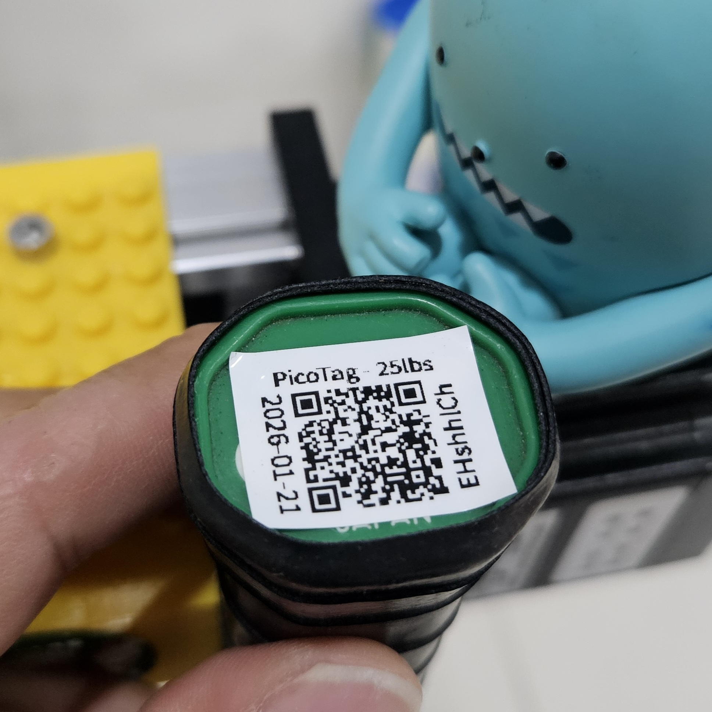
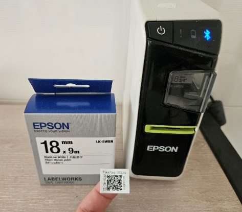
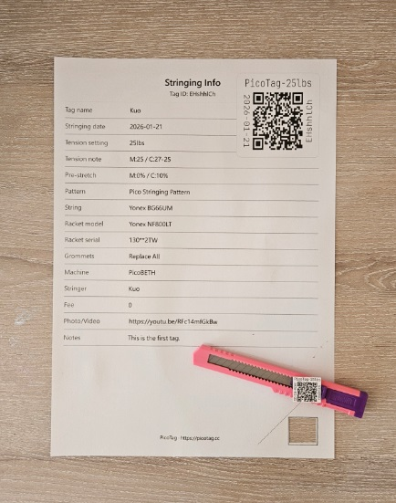

> [!TIP]
> 中文說明請點選上方連結

# PicoTag  
**QR Code–based Stringing Record System for Tennis & Badminton Rackets**

> A simple, hardware-agnostic QR code system for tennis and badminton racket stringing records.

## Public Web Interface
PicoTag can be used directly via the public web interface:

https://picotag.cc  

The public interface provides full QR Code generation and record viewing.  
Backend management features are available only when self-hosting.

> [!TIP]
> The public web interface is an official, production-use entry point and not a demo.  
> PicoTag is currently in its final public testing phase.  
> The source code will be published once the system is fully stabilized.

---

## Overview

PicoTag is an open-source tool designed to digitize racket stringing records.

Instead of handwritten stickers or paper notes that may fade or be lost, PicoTag generates a unique QR Code for each stringing job, allowing records to be easily viewed, shared, and referenced later.

For stringers, this creates a more consistent and professional presentation of their work.  
For racket owners, it improves transparency and access to stringing information.

---

## Core Capabilities

- **QR Code Stringing Records**  
  Each stringing job generates a unique QR Code containing tension settings, string and racket details, notes, and date information.

  **Example record page**: https://picotag.cc/?id=EHshhlCh

- **Pre-filled Stringing Requests**  
  Racket owners may prepare stringing requirements in advance to reduce communication errors.

- **Easy Sharing**  
  Records can be shared via QR Code or URL using a consistent, readable format.

---

## Optional: Self-Hosted Features

When PicoTag is deployed with the full system, additional features are available:
- backend record management  
- CSV export for further analysis  

Self-hosting is optional and intended for users who require full control over data and operation.

---

## Printing the QR Code

PicoTag works with common printing methods:

- **18mm label printers**  
  Quick, direct QR Code labels for racket frames.

  

- **Standard printers**  
  Print the information page and attach the QR Code manually.

  

No specialized or proprietary hardware is required.

---

## Deployment Options

- **Public Web Interface**  
  Use https://picotag.cc directly without installation.

- **Self-Hosted Deployment**  
  PicoTag is designed for deployment on Cloudflare.  
  The repository and deployment documentation are being prepared for public release.

---

## Data Handling, Usage & Responsibility

Information related to data handling, acceptable use, liability limitations, and responsibility boundaries for the **Public Web Interface** is documented separately.

Please review the following notice before using the service:

**[NOTICE.md](./NOTICE.md)**

This notice covers:
- data handling and retention practices  
- acceptable use and abuse handling  
- liability limitations  
- responsibilities for self-hosted deployments  

---

## Security & Contact

For security issues, vulnerabilities, or deletion requests related to the **official Public Web Interface**,  
please contact:

**500119.cpc@gmail.com**

Please do not include personal or sensitive information in public reports.  
When contacting, provide only necessary information (e.g. Tag ID).

---

## License & Attribution

PicoTag is released under the **MIT License**.

When using the original or derived web UI, please preserve:
- the project name **“PicoTag”**  
- and the footer attribution  

This is a branding and attribution request as described in:
- [LICENSE](./LICENSE)  
- [Attribution & Name Policy](./ATTRIBUTION.md)
