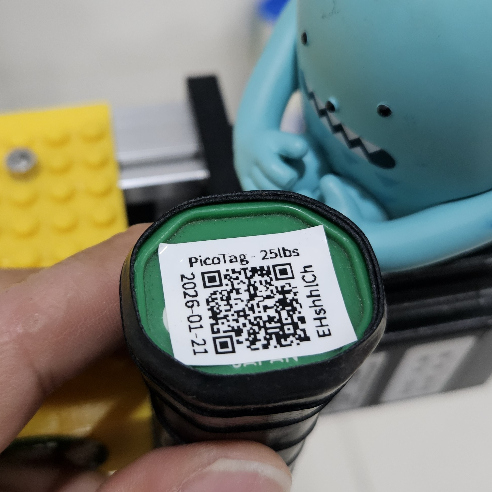
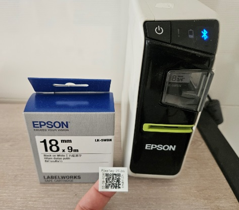
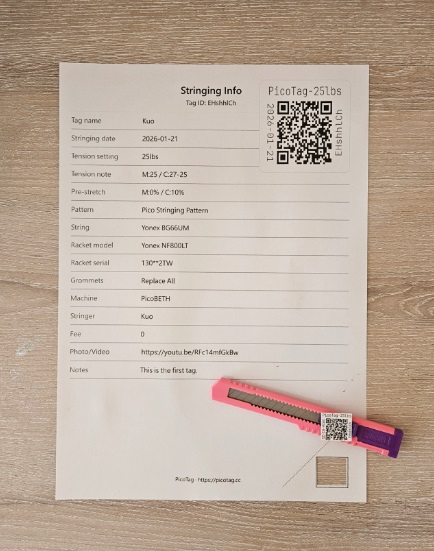

# PicoTag
**Badminton & Tennis Stringing Record QR Code System**

> Put a QR code tag on your racket to keep every stringing record: scan it to view the date, tension, string, racket info, and notes.  
> Hardware-agnostic — suitable for stringers, shops, and DIY stringers.

## Quick Overview: What can it do?

- **Create a Tag → Generate a QR Code → Print a label → Stick it on the racket**  
  Each stringing creates one record and a dedicated QR code label.

- **Owners scan to view records and share the link**  
  Scanning opens the record page, making it easy to review and share with friends or your stringer.

- **Different label layouts for badminton / tennis**  
  Supports **square labels for badminton** and **slim labels for tennis**, fitting different mounting spots.

- **Remark (Notes): record feel and feedback**  
  Add notes such as “how it feels”, “where it broke”, and “next tension/string to try”.  
  This helps you track and compare over time, and also provides useful feedback to your stringer for the next setup.

- **Admin features**  
  Manage reference lists (rackets/strings/patterns/stringers, etc.), browse all tag records, check system status, and personalize the site.

- **Export (CSV)**  
  Export records by date range, then analyze in Excel/Google Sheets (e.g., string usage, tension distribution, customer retention).

**Example record page**: https://picotag.cc/?id=EHshhlCh

---

## Public Web App

You can use PicoTag directly via the public web app:

**https://picotag.cc**

- Provides full **QR code generation** and **record lookup** features

> [!TIP]
> If you just want to use PicoTag without hosting your own site, you can create and look up Tags on the public site.  
> The public site does **not** provide admin pages (records/reference/site/system). Admin features are available only when you self-host.

---

## QR Code Printing (Common Options)

- **18mm label printer**: print fast and stick on the racket  
  

- **Regular printer**: print, cut, and stick  
  

---

## Documentation

Guides are organized in `docs/`:

- **User Guide**: [`docs/1.user-guide.en.md`](docs/1.user-guide.en.md)  
  For users and stringers: create Tags, attach labels, scan to view, and common features (includes a brief admin overview).

- **Deploy Guide**: [`docs/2.deploy-cloudflare.en.md`](docs/2.deploy-cloudflare.en.md)  
  For self-hosting: complete setup on Cloudflare Pages + KV + D1 + Turnstile.

- **Dev Guide**: [`docs/3.dev-guide.en.md`](docs/3.dev-guide.en.md)  
  For customization: download the Release ZIP → modify files → redeploy with Wrangler.

---

## Data Handling, Terms, and Disclaimer

For policies related to the **public web app** (data handling, usage rules, responsibilities, and disclaimers), please refer to:

**[NOTICE.md](./NOTICE.md)**

---

## Security & Contact

If you discover a security issue/vulnerability, or need help with a deletion request related to the **official public web app**, please contact:

**contact@picotag.cc**

Please do not post any personal or sensitive information in public channels.  
When contacting us, provide only the necessary details (e.g., Tag ID).

---

## License & Attribution

PicoTag is licensed under the **MIT License**.

When using the original or derived web interface, please keep:
- The project name **“PicoTag”**
- The footer attribution

References:
- [LICENSE](./LICENSE)
- [Attribution & Name Policy](./ATTRIBUTION.md)

---

## Acknowledgements

- **qrcodejs (davidshimjs)**: used for front-end QR code generation  
- **JetBrains Mono**: used as a monospace font (e.g., Tag ID / system info)  
