# 1 PicoTag Deployment Guide (Cloudflare Pages + Workers KV + D1 + Turnstile)

> This guide walks you from 0 to a working PicoTag site on Cloudflare: deploy the website, create KV / D1 / Turnstile, then initialize the database in the admin panel.

> Platform: Windows + PowerShell

> This guide is based on **PicoTag v1.0.2**; screens/options may differ slightly in other versions.

> You will need a Cloudflare account and the ability to install Node.js / Wrangler on your PC (step-by-step below).

> If you have questions, suggestions, or bugs to report, please use GitHub **Discussions** (help/discussion) or **Issues** (bugs).

## Table of Contents

- [1 Create and sign in to a Cloudflare account](#1-create-and-sign-in-to-a-cloudflare-account)
- [2 Install Wrangler CLI and upload the project](#2-install-wrangler-cli-and-upload-the-project)
  - [2-1 Install Node.js](#2-1-install-nodejs)
  - [2-2 Install Wrangler (Cloudflare deployment tool)](#2-2-install-wrangler-cloudflare-deployment-tool)
  - [2-3 Download the PicoTag release ZIP](#2-3-download-the-picotag-release-zip)
  - [2-4 First deployment to Cloudflare Pages](#2-4-first-deployment-to-cloudflare-pages)
- [3 Cloudflare setup (KV / D1 / Turnstile)](#3-cloudflare-setup-kv--d1--turnstile)
  - [3-1 Get your Pages domain (Domains)](#3-1-get-your-pages-domain-domains)
  - [3-2 Create Workers KV](#3-2-create-workers-kv)
  - [3-3 Create a D1 Database](#3-3-create-a-d1-database)
  - [3-4 Create Turnstile](#3-4-create-turnstile)
- [4 Configure Cloudflare Pages settings (Variables / Bindings)](#4-configure-cloudflare-pages-settings-variables--bindings)
  - [4-1 Variables (environment variables)](#4-1-variables-environment-variables)
  - [4-2 Bindings (D1 / KV)](#4-2-bindings-d1--kv)
- [5 Redeploy so settings take effect](#5-redeploy-so-settings-take-effect)
- [6 Front-end and admin initialization](#6-front-end-and-admin-initialization)
  - [6-1 Enter the admin panel](#6-1-enter-the-admin-panel)
  - [6-2 Initialize the D1 database](#6-2-initialize-the-d1-database)
  - [6-3 Initialize site personalization](#6-3-initialize-site-personalization)
  - [6-4 Create reference lists (optional)](#6-4-create-reference-lists-optional)
- [7 Create a Tag and verify everything works](#7-create-a-tag-and-verify-everything-works)

---

## 1 Create and sign in to a Cloudflare account

1. Sign up at Cloudflare: https://www.cloudflare.com/
2. Make sure you can successfully sign in to Cloudflare.

---

## 2 Install Wrangler CLI and upload the project

Before we start, here is what the two tools are for:

- **Node.js**: provides `npm` (package manager) and runtime. You need it to install Wrangler.  
- **Wrangler**: Cloudflare’s official deployment CLI. It uploads your PicoTag website files to **Cloudflare Pages** so your site goes live.

Next we’ll install Node.js, verify `node` / `npm`, then install and log in to Wrangler.

### 2-1 Install Node.js

1. Download the Node.js LTS version:
   https://nodejs.org/
2. Download the LTS build (e.g. `v24.13.1 (LTS)` — example only, use whatever is current)
3. Install with default options
4. Open PowerShell and check versions:

```powershell
node -v
npm -v
```

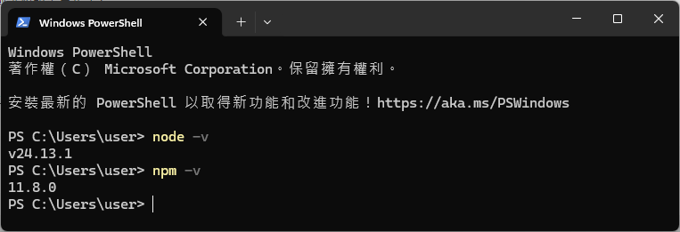

If you see version numbers (e.g. `v20.x.x`, `10.x.x`), installation is OK.

> If `npm -v` shows UnauthorizedAccess / PSSecurityException (PowerShell execution policy), run:
>
> ```powershell
> Set-ExecutionPolicy -Scope CurrentUser -ExecutionPolicy RemoteSigned
> ```
>
> Then close PowerShell, reopen it, and try `npm -v` again.

---

### 2-2 Install Wrangler (Cloudflare deployment tool)

#### 2-2-1 Install and login

Install Wrangler:

```powershell
npm i -g wrangler
```

Check installation:

```powershell
wrangler -v
```

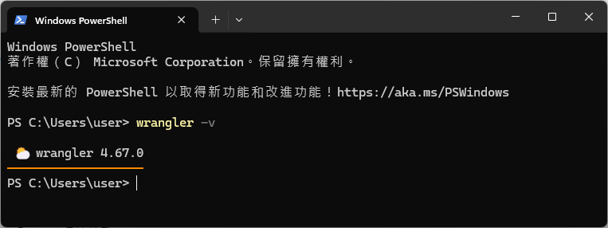

If you see a version number, Wrangler is installed.

Log in (usually only once):

```powershell
wrangler login
```

A browser window will open for Cloudflare authorization.

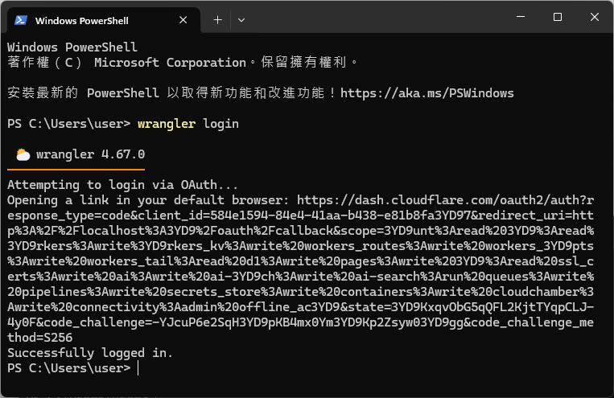

*Authorization successful*

---

### 2-3 Download the PicoTag release ZIP

1. Go to the GitHub project page → **Releases**, and open the version you want (e.g. **v1.0.2**).
2. Scroll down to the **Assets** section and download the ZIP package:  
   - **PicoTag-v1.0.2-20260226.zip** (for example, download this one)  
   - Please **do not** download GitHub’s auto-generated **Source code (zip)** / **Source code (tar.gz)** (those are automatically packaged source archives).
3. Extract the ZIP to a local folder (e.g. `C:\PicoTag`).
4. In PowerShell, change directory to that folder:

```powershell
cd C:\PicoTag
```

4. Run `dir` and confirm you are in the project root (you should see `index.html`):

```powershell
dir
```

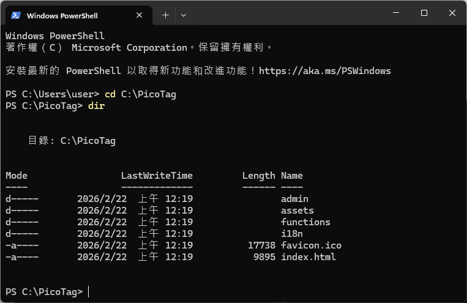

*Use `dir` to confirm you are in the project root*

---

### 2-4 First deployment to Cloudflare Pages

In the project root, run:

```powershell
wrangler pages deploy . --project-name picotag-demo
```

> Tip: `picotag-demo` is just an example name. You can choose your own project name (see the next section for naming rules).

Wrangler will ask interactive questions:

- `> Create a new project` → press Enter
- `? Enter the production branch name:` → press Enter (use default)

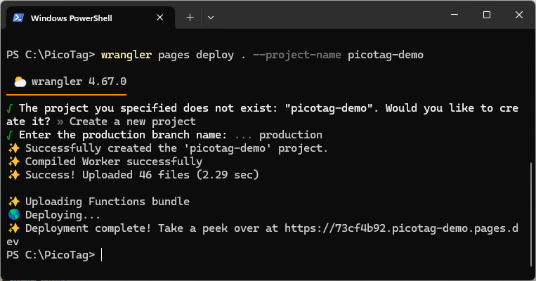

*Successful deployment output*

#### 2-4-1 Project name rules (project-name)

You can choose your own `project-name`, but follow these rules:

- lowercase letters and numbers only
- `-` (dash) is allowed
- no spaces, underscores, or uppercase
- cannot start or end with `-`

After deployment, Cloudflare will provide a default domain: `*.pages.dev`.

---

## 3 Cloudflare setup (KV / D1 / Turnstile)

In this chapter, you will create the 3 Cloudflare services PicoTag needs:

- **KV (Workers KV)**: stores fast-access “reference lists” (e.g. rackets, strings, patterns, machine, stringer).
- **D1 Database**: Cloudflare’s SQLite database for main records (Tags / records).
- **Turnstile**: human verification (similar to reCAPTCHA) to protect admin login from automated abuse.

Next, we will create these services and bind them to PicoTag in Cloudflare Pages settings.

### 3-1 Get your Pages domain (Domains)

1. `Compute -> Workers & Pages`
2. Open your Pages project (e.g. `picotag-demo`)
3. Find **Domains**, you will see something like:
   - `picotag-demo.pages.dev`

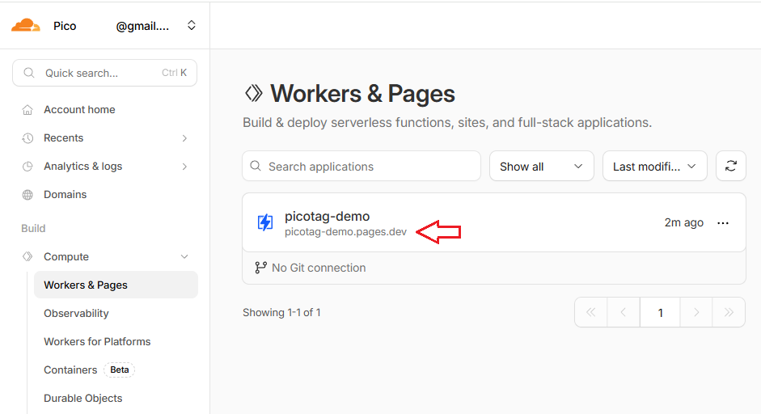

Save this domain — you will use it later.

---

### 3-2 Create Workers KV

1. `Storage & databases -> Workers KV`
2. Click `Create Instance` to create a KV namespace
3. Set Namespace name to `picotag`, then click Create

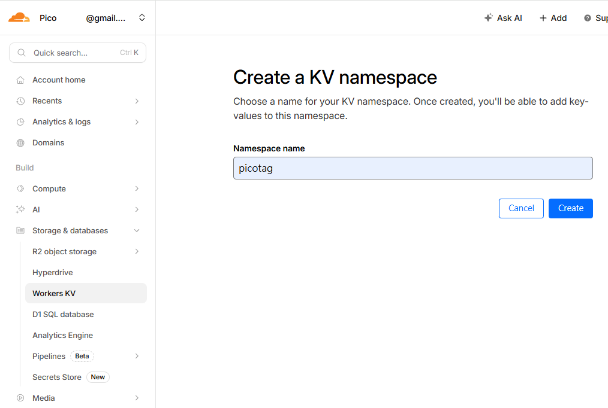

---

### 3-3 Create a D1 Database

1. `Storage & databases -> D1 Database`
2. Click `Create Database`
3. Set Name to `picotag`, then click Create

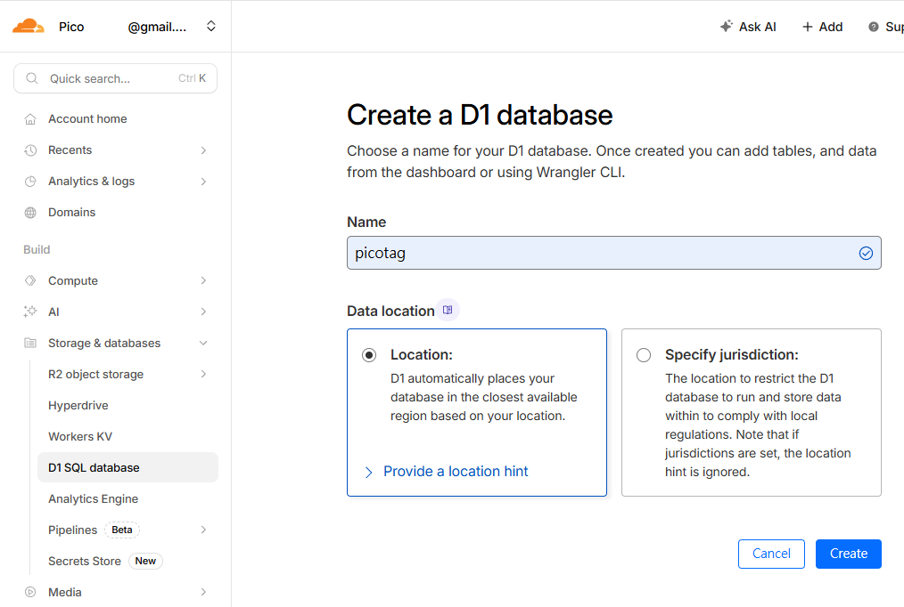

---

### 3-4 Create Turnstile

1. `Application security -> Turnstile`
2. Click `Add widget`
3. Fill:
   - `Widget name`: `picotag`
4. `Add Hostnames`:
   - `Add a custom hostname`: enter your Pages domain from 3-1  
     e.g. `picotag-demo.pages.dev`
   - Click `Add`
5. Check the hostname you added, click `Add`
6. Click `Create`

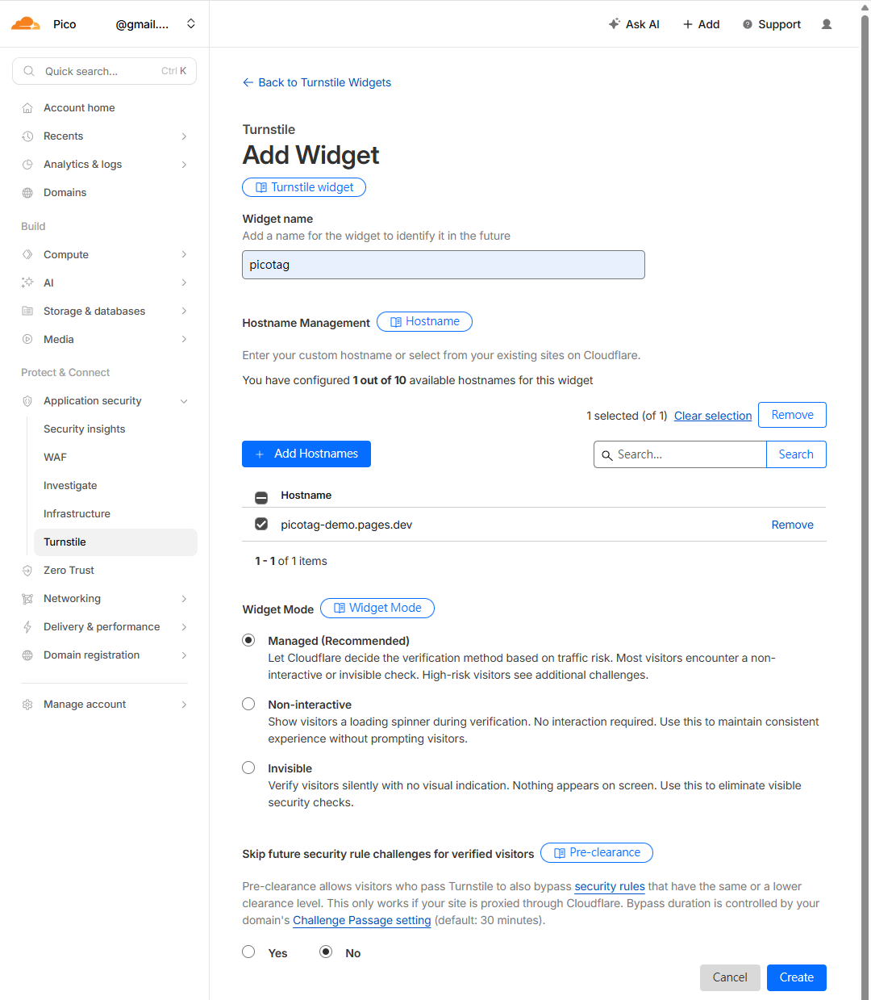

After creation you will get:

- `Site Key`
- `Secret Key`

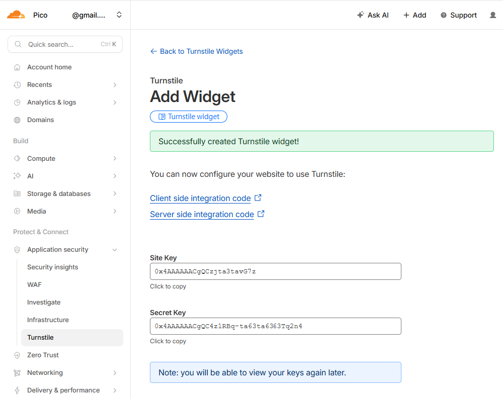

> **Do not expose the Secret Key.**

---

## 4 Configure Cloudflare Pages settings (Variables / Bindings)

Location: `Compute -> Workers & Pages -> (your project) -> Settings`

Here we provide “site settings” and “storage services” to PicoTag:

- **Variables**: configuration values (admin password, site origin domain, default language, Turnstile keys, etc.)
- **Bindings**: bind Cloudflare services (D1 Database and KV) so the code can read/write data.

> Important: After changing **Variables / Bindings**, you must go to the next chapter **“## 5 Redeploy so settings take effect”** and redeploy once. Otherwise, the live environment will not use your new settings.

### 4-1 Variables (environment variables)

Go to: `Variables and Secrets` → `Add`, and add:

| Type | Variable name | Value |
|---|---|---|
| `Text` | `ADMIN_PASSWORD` | `{your admin password}` |
| `Text` | `APP_ORIGIN` | `{the Domain from 3-1}` |
| `Text` | `DEFAULT_LANG` | `{default language, see 4-1-1}` |
| `Text` | `TURNSTILE_SITEKEY` | `{Site Key from 3-4}` |
| `Text` | `TURNSTILE_SECRET_KEY` | `{Secret Key from 3-4}` |

> Tip: Use a strong `ADMIN_PASSWORD` (e.g. 12+ characters with upper/lowercase, numbers, and symbols) to reduce brute-force risk.

#### 4-1-1 DEFAULT_LANG language codes (common)

You can use the following language codes:

- `en` — English
- `zh-TW` — Traditional Chinese
- `zh-CN` — Simplified Chinese
- `id` — Indonesian
- `hi` — Hindi
- `ta` — Tamil
- `ms` — Malay
- `th` — Thai
- `ja` — Japanese
- `ko` — Korean
- `vi` — Vietnamese
- `fil` — Filipino
- `da` — Danish
- `de` — German
- `fr` — French

---

### 4-2 Bindings (D1 / KV)

Go to: `Bindings` → `Add`, then add:

#### 4-2-1 D1 database

- Type: `D1 database`
- `Variable name`: `DB`
- `D1 database`: choose `picotag` created in 3-3

#### 4-2-2 KV namespace

- Type: `KV namespace`
- `Variable name`: `KV`
- `KV namespace`: choose `picotag` created in 3-2

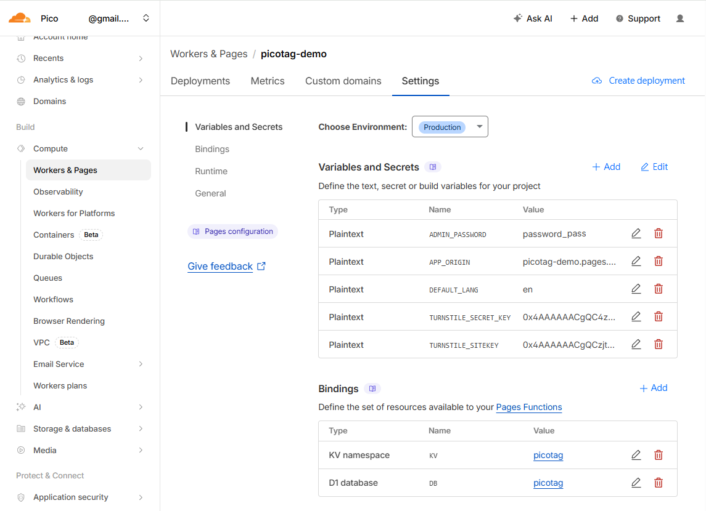

*Configuration complete*

---

## 5 Redeploy so settings take effect

> Important: Cloudflare Pages **Variables / Bindings** only take effect after a **redeploy**.

Back to PowerShell (project root) and deploy again:

```powershell
wrangler pages deploy . --project-name picotag-demo
```

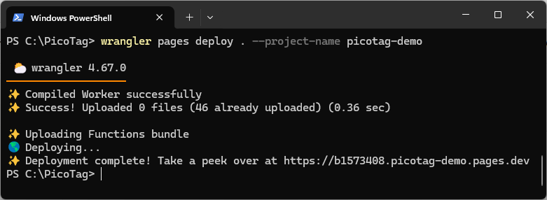

---

## 6 Front-end and admin initialization

From here, “front-end / admin” refers to your deployed **PicoTag website** opened via the domain you got in 3-1.  
For example, if your domain is `picotag-demo.pages.dev`, then:

- Front-end: `https://picotag-demo.pages.dev/`
- Admin: `https://picotag-demo.pages.dev/admin/`

### 6-1 Enter the admin panel

Open:

- `https://{your-domain}/admin/`

Enter the password set in `ADMIN_PASSWORD`.

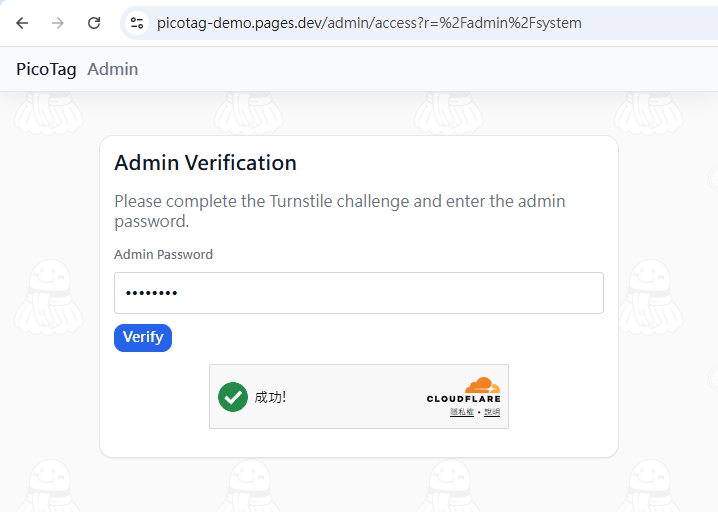

---

### 6-2 Initialize the D1 database

In `https://{your-domain}/admin/system`, find:

- `D1 Status (Tables) -> Initialize Database`

Click it to create tables (required for first-time setup).

---

### 6-3 Initialize site personalization

Go to:

- `https://{your-domain}/admin/site`

Fill in shop/site info, site name, footer links, etc.

---

### 6-4 Create reference lists (optional)

Go to:

- `https://{your-domain}/admin/reference`

Create commonly used lists (racket models, strings, stringers, patterns, etc.) to speed up Tag creation.

---

## 7 Create a Tag and verify everything works

1. In the admin panel, create a new Tag:
   `https://{your-domain}/admin/new`
2. Verify:
   - QR code can be generated successfully
   - Tag page opens and displays correctly
   - `admin/records` shows the new record
   - Reference dropdowns work (if configured)

---

After completing these steps, you will have your own PicoTag site running on Cloudflare Pages.
